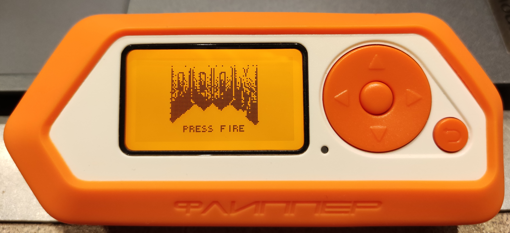
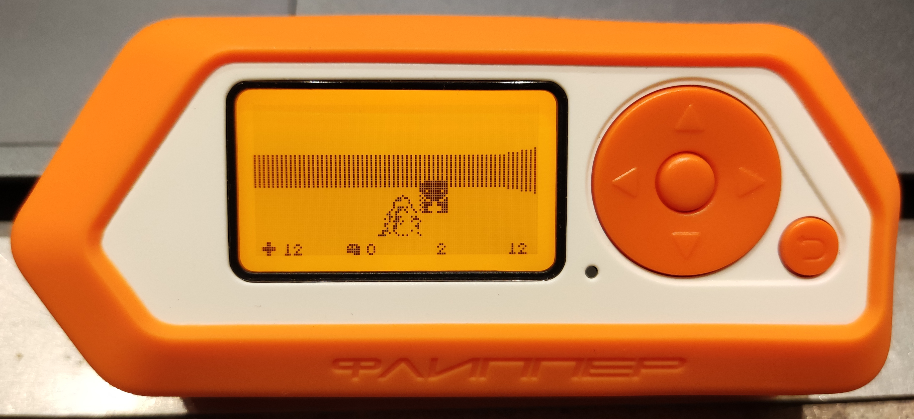

# Doom Flipper Zero edition

 <div style="text-align:center"></div>

## Will it run Doom?
As tradition goes, Doom is being ported to almost every possible embedded electronic device. Therefore I did an attempt to come up with something close to Doom and still compatible on the Flipper Zero's hardware.<br> This is not the actual Doom game but a port made from yet another Doom port to the Arduino Nano (https://github.com/daveruiz/doom-nano/). This port is basically a raycasting engine, using Doom sprites.<br>
This version is very basic and might be improved over time.

## How to install on Flipper Zero
During the porting process, minor changes were made to the workings (and build options) of the current firmware. These changes are documented here and are necessary in order to get a working firmware build that contains this Doom port.
### Modifying the firmware & build options
 * In the `sites/cc.scons` add the following values to the `CCFLAGS` section:
 ```
 ...
"-Wno-unused-parameter",
"-Wno-type-limits",
"-Wno-unused-variable",
...
 ```
 * In `applications/gui/canvas_i.h` comment out the following line:<br>
 `uint8_t* canvas_get_buffer(Canvas* canvas);` --> `//uint8_t* canvas_get_buffer(Canvas* canvas);`

 * In `applications/gui/canvas.h` add the following lines:
 ```
 uint8_t* canvas_get_buffer(Canvas* canvas);
 void canvas_draw_icon_bitmap(Canvas* canvas, uint8_t x, uint8_t y, int16_t w, int16_t h, const Icon* icon);
 ```
 * In `applications/gui/canvas.c` add the following function:
 ```
 void canvas_draw_icon_bitmap(Canvas* canvas, uint8_t x, uint8_t y, int16_t w, int16_t h, const Icon* icon){
     furi_assert(canvas);
     furi_assert(icon);

     x += canvas->offset_x;
     y += canvas->offset_y;
     uint8_t* icon_data = NULL;
     furi_hal_compress_icon_decode(icon_get_data(icon), &icon_data);
     u8g2_DrawXBM(&canvas->fb, x, y, w, h, icon_data);
 }
 ```

### Installing the plugin in the firmware
 * Make a folder called Doom in the applications folder. Add all the source files (also the compiled folder and it's files) in the Doom folder.
 * Make the `applications/meta/application.fam` look like the following:
 ```
 App(
     appid="basic_plugins",
     name="Basic applications for plug-in menu",
     apptype=FlipperAppType.METAPACKAGE,
     provides=[
         ...
         "doom_game",
         ...

     ],
 )
 ```

If all went well the only thing left to do is building the firmware and installing it to the Flipper.

## Screenshots




