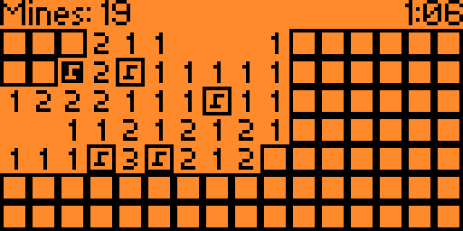

# Minesweeper

[Original Link](https://github.com/panki27/minesweeper)

This is a Minesweeper implementation for the Flipper Zero device.



## Controls

- Arrow buttons to move
- Push center button to open field
- Hold center button to toggle flag
- Push center button on an already open field that has the correct amount of flags surrounding it to auto-open the remaining ones (thanks @gelin!)

## Compiling

```
./fbt firmware_minesweeper
```
