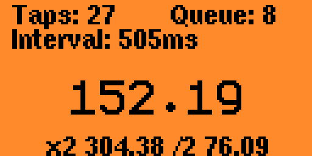

# BPM Tapper

A BPM Tapper for the Flipper Zero.



Hit any button other than back repeatedly. Calculates based on the average of the last 8 inputs.

## Compiling

```
./fbt firmware_bpm_tapper
```

