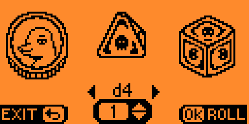

# Flipper Zero Dice App

## Screenshots

  

## Compiling

1. Clone the [flipperzero-firmware](https://github.com/flipperdevices/flipperzero-firmware) repository or another firmware that you use.
2. Create a symbolic link in `applications_user` named **dice**, pointing to this repository.
3. Compile by command `./fbt fap_dice_app`
4. Copy `build/f7-firmware-D/.extapps/dice_app.fap` to **apps/Tools** on the SD card  or by [qFlipper](https://flipperzero.one/update) app.
