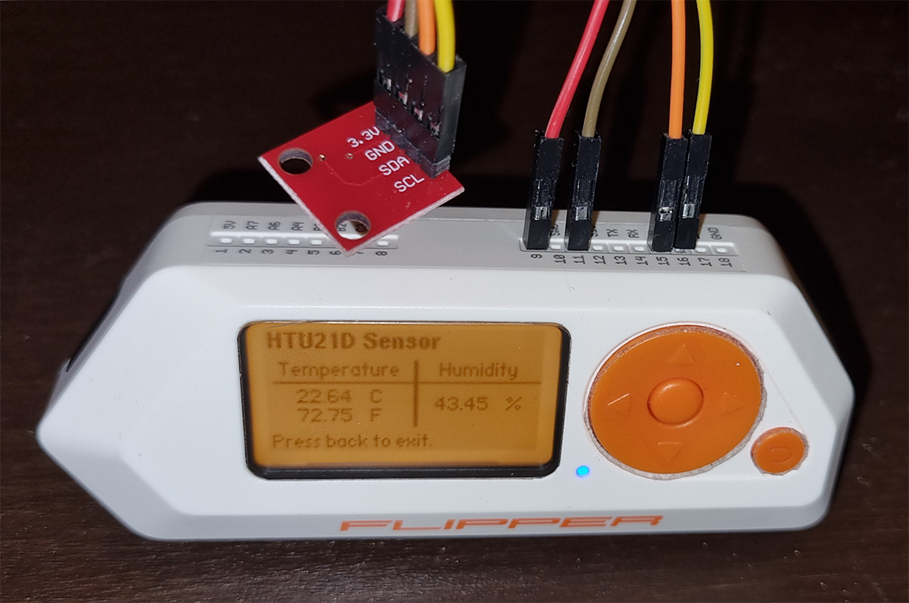
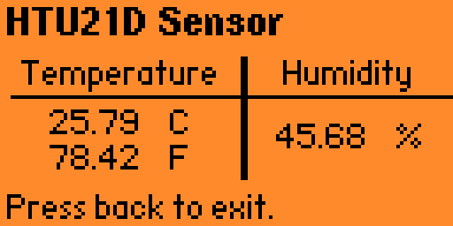

# Flipper Temperature Sensor - HTU21D / SI7021

[Original link](https://github.com/Mywk/FlipperTemperatureSensor)

## What is this?

A small app for the [Flipper Zero](https://flipperzero.one) that reads the [I2C](https://en.wikipedia.org/wiki/I%C2%B2C) signal from a HTU21D or Si7021 sensor and displays the current temperature and humidity.

I'm using a [Sparkfun HTU21D sensor](https://learn.sparkfun.com/tutorials/htu21d-humidity-sensor-hookup-guide), also tested with a clone and with the Si7021 variant.

## How to Connect the sensor

