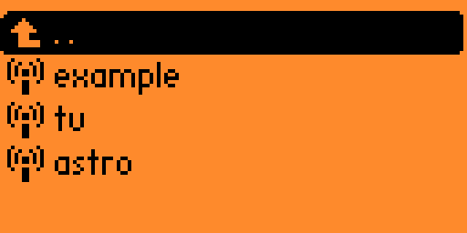
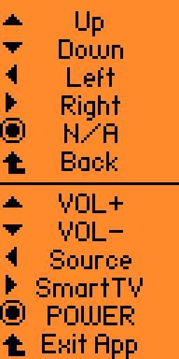

# Alternative Infrared Remote for Flipperzero

It is a plugin like [UniversalRF Remix](https://github.com/ESurge/flipperzero-firmware-unirfremix) but for infrared files. I do this plugin for convenience, because the main IR app need to navigate for different button abit troublesome (buttons like up,down,left,right,back). I found it useful for TV and TV box.

It supports short press and long press input for different ir remote buttons. Tested on the [unleashed firmware version unlshd-015](https://github.com/DarkFlippers/unleashed-firmware/releases/tag/unlshd-015)


## How to install

1. Update unleashed firmware to the version unlshd-015, then download the `ir_remote.fap` from [releases](https://github.com/Hong5489/ir_remote/tags)

2. Put the `ir_remote.fap` file in your flipper's SD card, under `apps` folder

## How to use

1. Similar to UniRF app, put the path of the ir file and the ir button for each button on flipper (UP,DOWN,LEFT,RIGHT,BACK)

The format With `HOLD` one is long press, without is short press

Example of the configuration file:
```
REMOTE: /ext/infrared/Philips_32PFL4208T.ir
UP: Up
DOWN: Down
LEFT: Left
RIGHT: Right
OK: 
BACK: Back
UPHOLD: VOL+
DOWNHOLD: VOL-
LEFTHOLD: Source
RIGHTHOLD: SmartTV
OKHOLD: POWER
```

Leave it empty for the button you don't need

2. Save it as `.txt` file, then create a new folder in your SD card `ir_remote`, put it inside the folder

3. Lastly, you can open the app, choose the configuration file, then you can try out the ir for each buttons

4. Long press back button to exit the app

## How to build 

You can clone this repo and put it inside the `applications_user` folder, then build it with the command:
```
./fbt fap_ir_remote
```
Or you can build and run it on your flipper with the command:
```
./fbt launch_app APPSRC=applications_user/ir_remote
```

## Screenshots

Choose config file to map



Show all button name in the config file (If empty will show N/A). Upper part short press, Lower part long press

