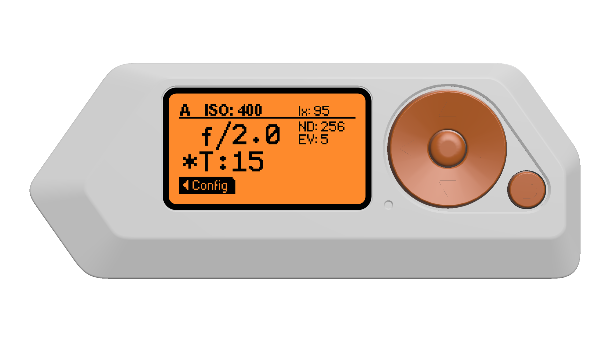
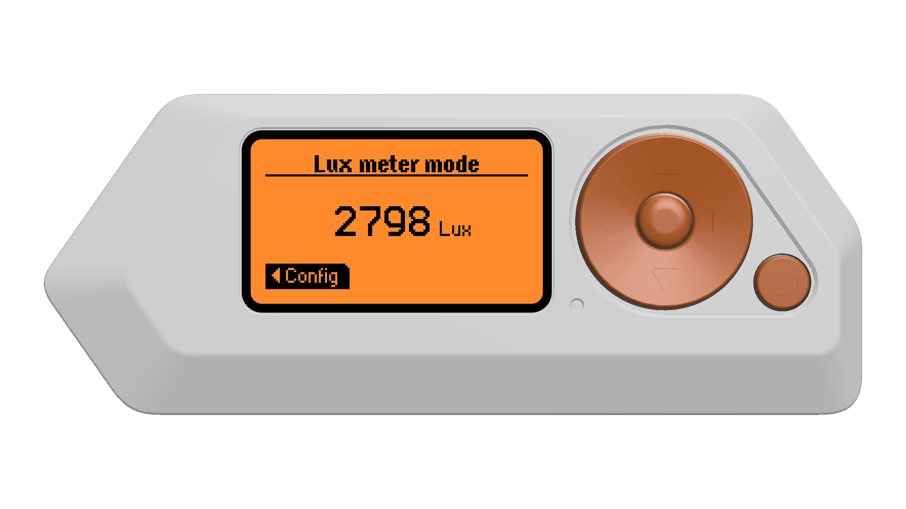
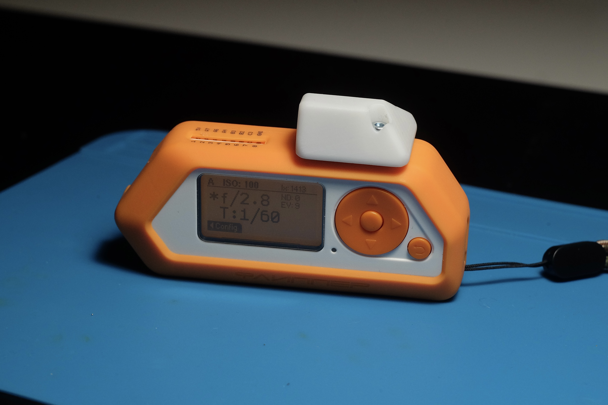

# flipperzero-lightmeter

[](https://github.com/oleksiikutuzov/flipperzero-lightmeter/actions/workflows/build.yml)





## Wiring

```
VCC -> 3.3V
GND -> GND
SCL -> C0
SDA -> C1
```

## Sensor module



### If you want to build this module, you'll need (it's quite over-engineered, sorry :D)
1. [Module PCB](https://github.com/oleksiikutuzov/flipperzero-lightmeter/blob/main/module/module_v2_gerber.zip)
2. [Enclosure](https://github.com/oleksiikutuzov/flipperzero-lightmeter/blob/main/module/module_v2_enclosure.stl)
3. 4-pin female header
4. 10-pin male header
5. 2x M3 threaded inserts (max diameter 5.3 mm, max height 4 mm)
6. 2x M3x5 screws


## TODO
- [ ] Save settings to sd card

## References
App inspired by [lightmeter](https://github.com/vpominchuk/lightmeter) project for Arduino by [vpominchuk](https://github.com/vpominchuk).
