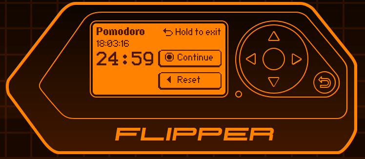
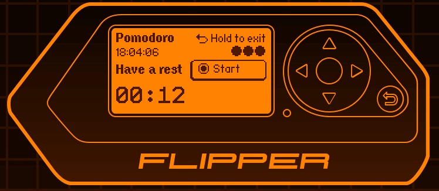

# flipperzero_pomodoro

The Pomodoro Technique is a time management method developed by Francesco Cirillo in the late 1980s.[1] It uses a kitchen timer to break work into intervals, typically 25 minutes in length, separated by short breaks. Each interval is known as a pomodoro, from the Italian word for tomato, after the tomato-shaped kitchen timer Cirillo used as a university student.

Flipper Zero is a portable Tamagotchi-like multi-functional device developed for interaction with access control systems. The device is able to read, copy, and emulate radio-frequency (RFID) tags, radio remotes, and digital access keys.

## Pomodoro timer application for Flipper Zero

Three timers available:

- classic 25 min work, 5 min rest
- long 50 min work, 10 min rest
- sprint 10 min work, 2 min rest

With tomato counter

Plays sound alerts

Has built-in clocks

Screenshots:

Compatible with firmware v. F81999EA from 14 Oct. 2022
