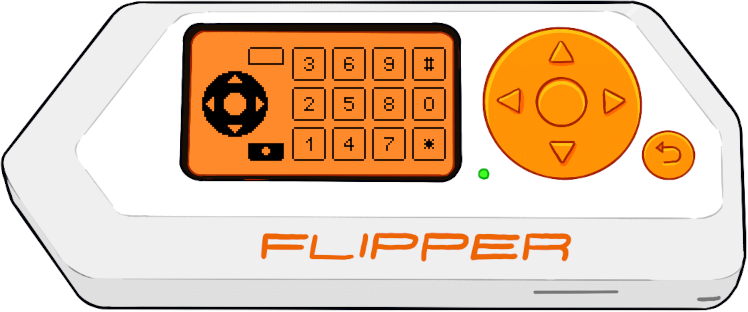

# RC2014 ColecoVision Controller for Flipper Zero

A Flipper Zero application and [RC2014] module allowing the Flipper to be used as a controller for ColecoVision games on
the [RC2014].

## Running ColecoVision Games on the RC2014

A full tutorial is out of scope here, but briefly, you will need a [RC2014] with J. B. Langston's [TMS9918A Video Card]
and [SN76489 Sound Card], as well as some way to launch ColecoVision ROMs.

Note that if you're using the standard pageable ROM module (e.g. if you're using the stock Pro kit), you will need to
[modify it](https://github.com/jblang/TMS9918A/issues/12) in order for the TMS9918A module to work on the ColecoVision
port addresses.

## Hardware Setup

The [interface](interface) directory contains Eagle schematics for a RC2014 module that handles the controller port
addressing for two players, breaking out the 8 data line inputs as well as the mode select line. This can actually be
used for different controller implementations and is slightly more flexible than the actual [ColecoVision] spec.

To use this with the Flipper Zero and this application, a GPIO board is needed to provide hardware multiplexing for the
data lines. A schematic for the GPIO board will be added to this repository soon.

## Building the FAP

1. Clone the [flipperzero-firmware] repository.
2. Create a symbolic link in `applications_user` named `coleco`, pointing to this repository.
3. Compile with `./fbt fap_coleco`.
4. Copy `build/f7-firmware-D/.extapps/coleco.fap` to `apps/Misc` on the SD card (directly or using [qFlipper]).

[RC2014]: https://rc2014.co.uk/
[TMS9918A Video Card]: https://github.com/jblang/TMS9918A
[SN76489 Sound Card]: https://github.com/jblang/SN76489
[ColecoVision]: http://www.atarihq.com/danb/files/CV-Tech.txt
[flipperzero-firmware]: https://github.com/flipperdevices/flipperzero-firmware
[qFlipper]: https://flipperzero.one/update
