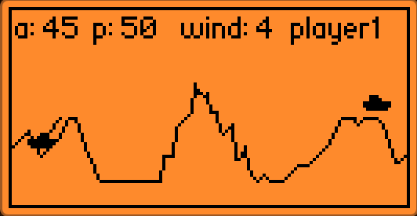

# Scorched tanks - flipper zero game
A flipper zero game inspired by scorched earth.

Current state is shown below:

## How to do:
Do not hesitate to create PRs. If you start working on sth, please start branch name with TODO id (e.g. `feature/2-change-tank-icon`)

If you see an improvement, modify this readme and add suggestions via PR. Bugs can be reported via Issues

## What to do next (it's not in the priority order):
5. flatten surface beneath tanks
7. explosion animation
9. sub-ghz multi-player
11. add other types of weapons
12. code AI
13. add terain destruction
14. add terain gravity (fall down after hitting the middle of the mountain)
18. Add menu with settings (vibartion on/off, difficulty)
20. add more ground modifiers (currently there is only one hill in the middle, maybe 2 hills, skew map, etc)

## What have been done:
1. ~~remove movement~~
2. ~~change tank icon~~
3. ~~power as variable not constant~~
4. ~~better map generation: high, low regions~~ (continuation in point 20.)
6. ~~collision with the enemy~~
8. ~~local multi-player~~
10. ~~improve projectile trace draw on angles > 80~~
15. ~~FIX: firing stops when bullet fly above the screen~~
16. ~~Slightly randomize player and enemy spawn locations~~
17. ~~Shooting vibration~~
19. ~~Add wind~~
