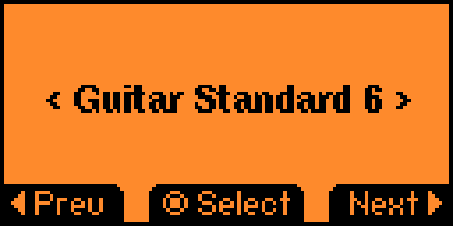

# Tuning Fork

Inspired by [Metronome](https://github.com/panki27/Metronome)

A tuning fork for the [Flipper Zero](https://flipperzero.one/) device.
Allows to play different notes in different pitches.



## Features
- Tuning forks (440Hz, 432Hz, etc.)
- Scientific pitch (..., 256Hz, 512Hz, 1024Hz, ...)
- Guitar Standard (6 strings)
- Guitar Drop D (6 strings)
- Guitar D (6 strings)
- Guitar Drop C (6 strings)
- Guitar Standard (7 strings)
- Bass Standard (4 strings)
- Bass Standard Tenor (4 strings)
- Bass Standard (5 strings)
- Bass Standard Tenor (5 strings)
- Bass Drop D (4 strings)
- Bass D (4 strings)
- Bass Drop A (5 strings)

## Compiling

```
./fbt firmware_tuning_fork
```
