# [FlipperZero] Wii Extension Controller Protocol Analyser
This Protocol Analyser offers a full Test and Calibrate system for Wii Extension Controllers.

__Disclaimer:__ *Use of this plugin, and notably connecting an Extension Controller to the FlipperZero is performed entirely at your own risk.*

# Notes
This plugin has (todate) only been tested with official Nintendo Nunchucks and Classic Controllers - namely Nunchucks and Classic Controllers.

# Encryption
This plugin has SOME code to handle encryption, but it it unused, untested, and some of it is known to un-work.

This plugin (currently) only works with Extension Controllers which implement the encryption-bypass strategy. IE. `i2c_write(0xf0, 0x55) ; i2c_write(0xfb, 0x00)`

If you need this functionality, either raise an Issue or, better still, a Pull Request.

# Screen: SPLASH
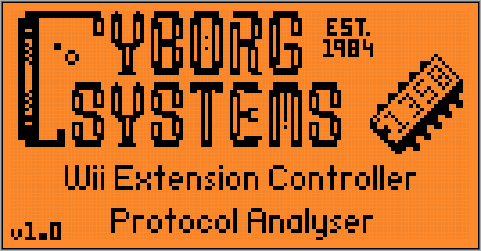<br/>
The SPLASH Screen is displayed when the Plugin starts. It can be cleared by pressing any key, else it will auto-clear after 3.5 seconds.

# Screen: WAIT
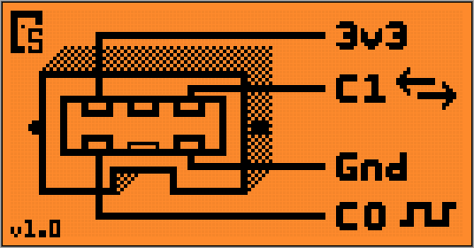&nbsp;&nbsp;&nbsp;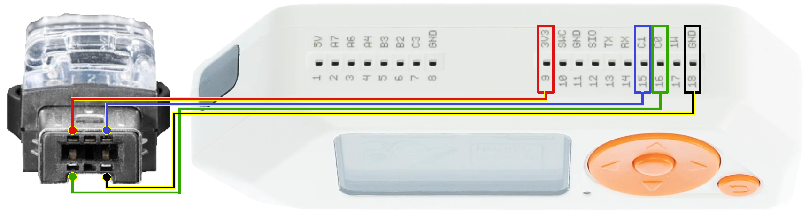<br/><br/>
The WAIT screen will display which pins you need to connect between the flipper and the Wii Extension Controller.

__Disclaimer:__ Use of this plugin, and notably connecting the Controller to the FlipperZero is performed entirely at your own risk.

Looking in to the exposed side of the Extension Controller plug, with the notch on the bottom

| EC Pin # | EC Position | EC Pin ID | Pin Function | FZ GPIO Pin Name | FZ GPIO Pin # |
| :---: | :---: | :---: | :---: | :---: | :---: |
| 1 | top-left | +3v3 | Power | 3v3 | 9 |
| 2 | bottom-left | SCL | i2c clock | C0 | 16 |
| 3 | top-centre | EN | ¿detect? | | |
| 4 | bottom-centre | -x- | -none- | | |
| 5 | top-right | SDA | i2c data | C1 | 15 |
| 6 | bottom-right | Gnd | Power | Gnd | 18 |

Keys:
* Left - Show splash screen
* Back - exit plugin

The easiest way to connect a Wii Extension Controller to a FlipperZero is arguably with a ["WiiChuck"](https://www.ebay.co.uk/sch/?_nkw=wiichuck) or a ["Nunchucky"](https://www.solarbotics.com/product/31040)<br/><br/>
<table style="border:none">
  <tr><td>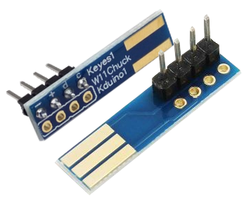</td>
      <td>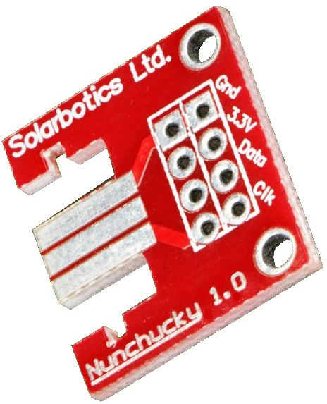</td></tr>
  <tr><td align="center"><a href="https://www.ebay.co.uk/sch/?_nkw=wiichuck">WiiChuck</a></td>
      <td align="center"><a href="https://www.solarbotics.com/product/31040">Nunchucky</a></td></tr>
</table>

### ** WARNING **
Neither the WiiChuck, nor the Nunchucky have a pin polarisation mechanism.<br/>
If you plug the adaptor in the wrong way around you WILL apply voltage to the Controller the wrong way round!!<br/>
I have no idea if THIS WILL PERMANENTLY KILL THE CONTROLLER ...Who wants to try it?

On all the WiiChucks I have seen:
* The WiiChuck has THREE connectors on one side, and TWO connectors on the other.
* The side with TWO connectors should go against the side of the Controller plug with the big indent.
```
+-------------+
|  _________  |
| | =  =  = | |
| |_=_____=_| | <-- notice missing pin
|     ___     |
|    |   |    | <-- notice indent
+----+   +----+
```
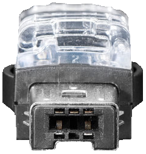<br/>

...BUT I *highly* recommend you check the pins on your adaptor to make sure everything goes well.

I believe the unconnected pin on the top is a "presence detect" function, but I have not (yet) verified this.<br/>
This feature is NOT required by this plugin, as the detection is performed by means of an i2c handshake.

When a device is connected it will be immediately recognised. If it is not, either:
* The Controller is not correctly connected<br/>
...This may be as simple as a broken wire.
* The controller board in the Controller is faulty.<br/>
...Repair of which is beyond the scope of this document.

To get the list of "known" Controllers, run `./info.sh`<br/>
As of writing this, that returns:
```c
[PID_UNKNOWN    ] = { {0x00, 0x00, 0x00, 0x00, 0x00, 0x00}, "Unknown Perhipheral", SCENE_DUMP,
[PID_NUNCHUCK   ] = { {0x00, 0x00, 0xA4, 0x20, 0x00, 0x00}, "Nunchuck", SCENE_NUNCHUCK,
[PID_CLASSIC    ] = { {0x00, 0x00, 0xA4, 0x20, 0x01, 0x01}, "Classic Controller", SCENE_CLASSIC,
[PID_BALANCE    ] = { {0x00, 0x00, 0xA4, 0x20, 0x04, 0x02}, "Balance Board", SCENE_DUMP,
[PID_GH_GUITAR  ] = { {0x00, 0x00, 0xA4, 0x20, 0x01, 0x03}, "Guitar Hero Guitar", SCENE_DUMP,
[PID_GH_DRUMS   ] = { {0x01, 0x00, 0xA4, 0x20, 0x01, 0x03}, "Guitar Hero World Tour Drums", SCENE_DUMP,
[PID_TURNTABLE  ] = { {0x03, 0x00, 0xA4, 0x20, 0x01, 0x03}, "DJ Hero Turntable", SCENE_DUMP,
[PID_TAIKO_DRUMS] = { {0x00, 0x00, 0xA4, 0x20, 0x01, 0x11}, "Taiko Drum Controller)", SCENE_DUMP,

```

You can see that there are EIGHT known devices. One is the default for an unknown controller; SEVEN devices are known by name; and TWO (of those seven) have bespoke "scenes" (ie. SCENE_NUNCHUCK & SCENE_CLASSIC).

# Screen: NUNCHUCK - MAIN
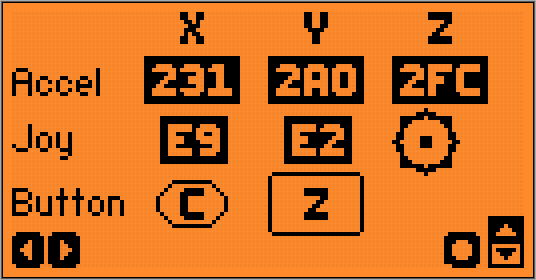<br/>
When you connect a Nunchuck, you will see a screen displaying:
* Accelerometer{X,Y,Z} values
* Joystick{X,Y} values
* Joystick graphic
* Button{C,Z}

Keys:
* Left       - Go to the DUMP screen
* Right      - Go to the NUNCHUCK_ACC accelerometers screen
* Up/Down/OK - [qv. Peak Meters]
* Short-Back - Reset controller
* Long-Back  - Exit plugin

# Screen: NUNCHUCK - ACCELEROMETERS

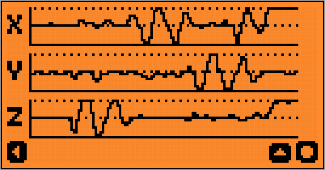&nbsp;&nbsp;&nbsp;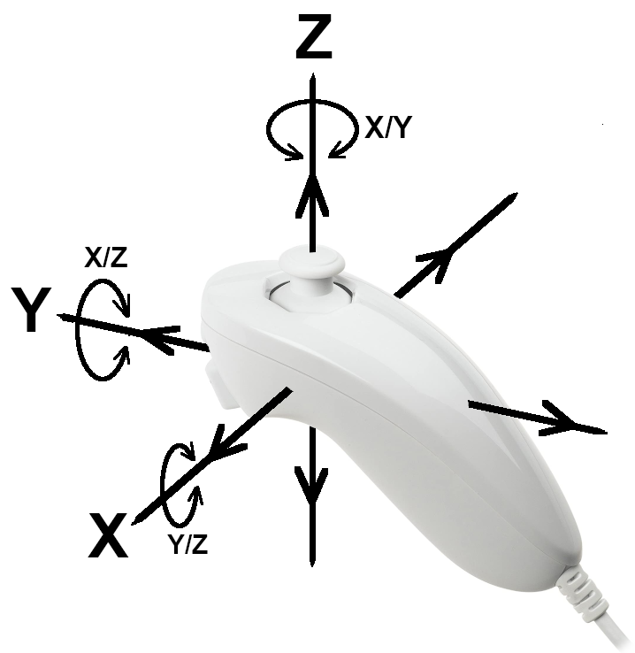<br/>

| Axis | Movement | Lower | Higher |
| :---: | :---: | :---: | :---: |
| X | Left / Right | Left | Right |
| Y | Fwd / Bkwd   | Fwd  | Bkwd |
| Z | Down / Up    | Down | Up |

* Movement in the direction of an axis changes that axis reading
* Twisting/tilting around an axis changes the other two readings
* EG. 
  * Move left (along the X axis) will effect X
  * Turn left (a rotation around the Y axis) will effect X and Z

Keys:
* Left       - go to the main NUNCHUCK screen
* Up
  * Auto-Pause Disabled --> Enable Auto-Pause
  * Paused at the end of a page --> Restart scanner
  * Running with Auto-Pause Enabled --> Disable Auto-Pause
* Nunchuck-Z - Toggle pause
* Nunchuck-C - Toggle auto-pause
* Long-OK    - Enter Software Calibration mode [qv. Calibration]
  * Calibration mode on the Accelerometer screen will ONLY calibrate the accelerometer
* Short-OK   - Leave Software Calibration mode *and* Calibrate CENTRE position(s)
* Short-Back - Reset controller
* Long-Back  - Exit plugin

<sub>NB. Code DOES exist to scroll the display, but the LCD refresh rate is too low, and it looks awful</sub>

# Screen: CLASSIC
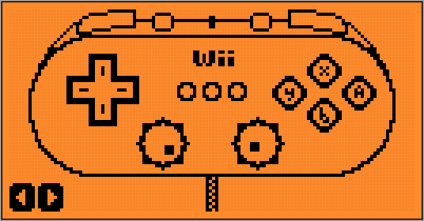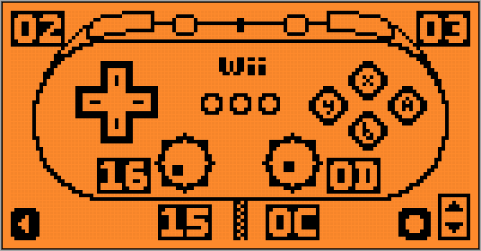<br/>
When you connect a Classic Controller [Pro], you will see a screen displaying a Classic Controller
* The Classic Controller will animate in line with controller events 
* The scan rate is set to 30fps, but in reality there is a bit of lag with the LCD screen, so YMMV.

Keys:
* Left       - go to the DUMP screen
* Right      - show analogue readings (Left to hide them again)
* Up/Down/OK - [qv. Peak Meters]
* Short-Back - Reset controller
* Long-Back  - Exit plugin

# Screen: DUMP
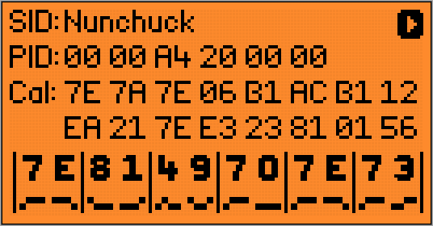<br/>
The Dump screen will show you the raw readings from the device.<br/>
If you connect a device which does not have a bespoke `_decode()` function (etc.), you will see (only) this screen.
* SID - String ID - human-readable name (from the `info` table)
* PID - Peripheral ID - The 6 bytes which identify the device.
* Cal - Calibration data - 16 bytes
* The bottom row of hex shows the SIX bytes of Controller data
  * Below each hex digit is the binary representation of that digit
  * By example. With a Nunchuck connected, click the Z button, and watch the bit on the far right

Keys:
* Right      - return to controller-specific screen (if there is one)
* Short-Back - Reset controller
* Long-Back  - Exit plugin

# Peak Meters (Calibration values)

On any Controller-specific screen with a Peak/Trough menu displayed:
* Up       - [toggle] only show peak values
* Down     - [toggle] only show trough values
* Long-OK  - Enter Software Calibration mode [qv. Calibration]
* Short-OK - Leave Software Calibration mode / Calibrate CENTRE position(s)

# Calibration
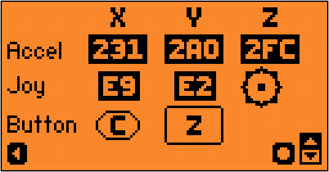<br/>

* __This project handles Calibration of Analogue Controls, but has NO understanding of Accelerometer values (yet).__

Digital buttons do NOT require Calibration.

Some Calibration data is calculated at the factory, and stored in memory (¿OTP?) on the Controller.

Each device has a different way to interpret the Calibration Data.<br/>
EG. A Nunchuck has one joystick, and an accelerometer ...whereas a Classic Controller has 2 joysticks and 2 analogue buttons.

I have personally found the calibration data to be inaccurate (when compared to actual readings), I guess Controllers drift over the years‽
If the factory-values LIMIT movement, this is easily resolved - by expanding them on-the-fly.<br/>
BUT, I have seen Controllers with factory calibration data that suggests the limits are FURTHER than the joystick can reach ...and this requires a full re-calibration of the Controller!

Probably the best way to calibrate is to:
* Take a/some reading(s) while the Controller is 'at rest', IE. perfectly still and level.
* Move the Controller to all extremes and store the extreme {peak/trough} values.

Nintendo (allegedly) take the 'at rest' reading immediately after the Controller is connected, and a 're-calibration' can be performed at any time by pressing {`A`, `B`, `+`, `-`} at the same time, for at least 3 seconds.  Although I have no details on what this actually does.

### This tool calibrates as such:
* When the Controller is first recognised
  * The factory Calibration data is used to decide the Centre/Middle position and extreme values (eg. far-left & far-right) for each analogue Control
* Long-OK button press (on the FlipperZero) ...Do NOT touch ANY of the analogue controllers while you are pressing Long-OK
  * Start the calibrate button flashing
  * Take the current reading as the Centre position
  * Set the range limits to "no range"
  * You must now move the Control between its extremes, so the code can work out the new Calibration/range/peak+trough values
  * When done, press Short-OK to end Software Calibration mode
* Short-OK button press (on the FlipperZero) ...Do NOT touch ANY of the analogue controllers while you are pressing Short-OK
  * Stop the calibrate button flashing
  * Calibrate the centre position of all analogue controls (accelerometers not supported (yet))

# Screen: DEBUG
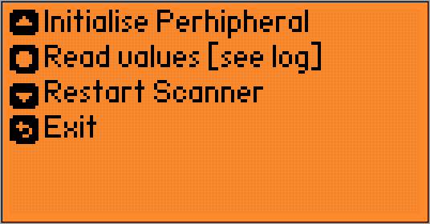<br/>
On any screen (except SPLASH) you may press Long-Down to enter Debug mode.

You can (at any time) attach to the FlipperZero (via USB) with a serial console {`minicom`, `putty`, whatever} and start the `log` function to see the debug messages.

When you enter the DEBUG screen, the real-time scanner will be stopped. And the following keys made available:
* Up - Attempt to initialise the attached Controller
* OK - Take a reading from the attached Controller
* Long-Down - Restart the real-time scanner and return to the WAIT screen

You can limit the messages at compile-time [see `./info.sh`], or at runtime [FZ->Settings->System->LogLevel]<br/>

[This is probably irrelevant since the introduction of FAP support]<br/>
If you have memory issues, limiting the messages at compile-time will make the plugin smaller.<br/>
But (¿obviously?) the more you limit the messsages, the less debug information will be sent to the logger.

# TODO

* FZ Bug: At the time of writing this, there are problems with the i2c FZ functions [qv `i2c_workaround.c`]

