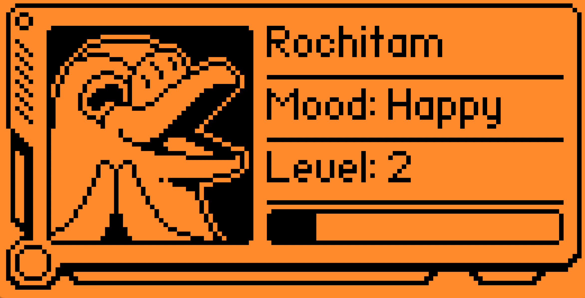
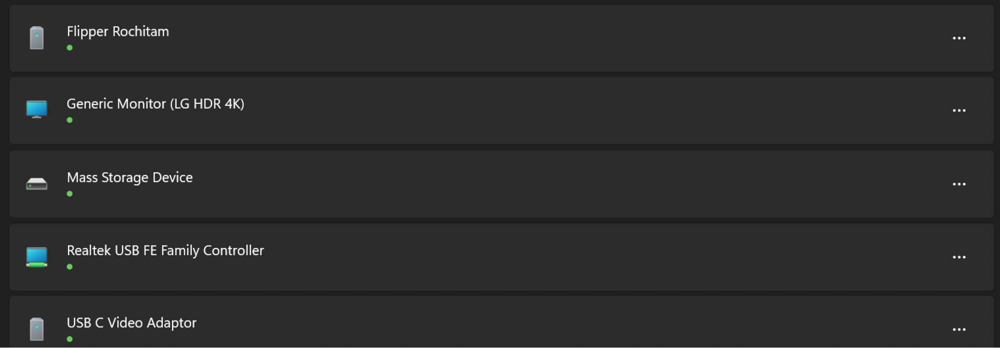
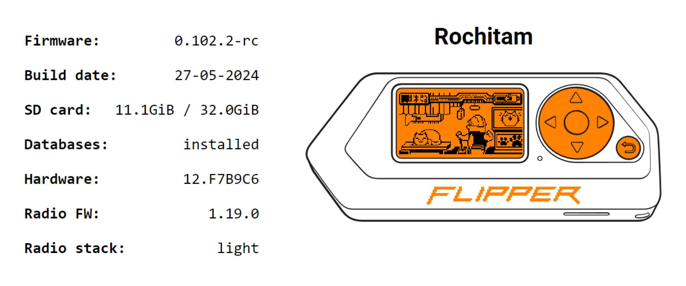

# General — Test Cases

## 1. BLE

Steps:

1. Go to Settings → BT → BT ON, and return to the main screen.

   **Expected result:** BT icon appears after switching on.

2. Restart device.

   **Expected result** after reboot BT is on.

3. Open the Mobile application and find Flipper in the list of Bluetooth devices on your phone and connect to it.

   **Expected result:**
     1. Pairing with a companion works.
     2. The correct name of the flipper in the list of devices (Flipper NAME).
     3. The application has successfully connected and shows the correct flipper data.

4. Close companion.

5. Open the companion on another phone and repeat the pairing.

   **Expected result:** the pairing is working again.

6. Close the application and connect the first companion.

   **Expected result:** the application has connected.

## 2. Using the U2F application

Steps:

1. Launch the U2F application.

2. Go to [Yubico demo website](https://demo.yubico.com/webauthn-technical/registration).

3. Register the key.

   **Expected result:**
     1. A system window appears asking you to press the key (flipper) button.
     2. Registration completed successfully.
     3. (auth) appeared on the same page.

4. Pass key authentication.

   **Expected result:**
     1. A system window appears asking you to press the key (flipper) button.
     2. Authentication was successful.

## 3. Settings. Pin Code

Steps:

1. Select PIN Setup.

    **Expected result:** instructions for setting a password appeared.

2. Create a password.

    **Expected result:** password set.

3. Lock your device and press any button.

    **Expected result:** when pressed, a password entry window appears.

4. Enter the wrong password.

    **Expected result:** if the password is incorrect, the password repeat window and the red indicator is on.

5. Enter the wrong password several times and reboot the device.

    **Expected result:**

      1. When entering multiple entries, a waiting time appears and is incremented in case of incorrect attempts.
      2. When rebooting, the password entry timer starts again.

6. Enter the correct password.
    **Expected result:** Flipper is unlocked with the correct password.

7. Go to Settings > Desktop and change password

    **Expected result:** the password has changed and is correct.

8. Go to Settings > Desktop and remove password.

    **Expected result:** the password has been deleted.

9. Enable automatic blocking of a device with an added pin.

    **Expected result:** Flipper locked automatically.

10. Unlock Device.

    **Expected result:** Flipper unlocked with the correct pin.

11. Reboot device and Unlock.

    **Expected result:** Flipper was locked after reboot and unlocked successfully.

## 4. Settings. Storage

Steps:

1. Settings → Storage → About internal storage.

   **Expected result:**
     1. Displays device name, file system type.
     2. Total storage capacity and available capacity in kilobytes.

2. Settings → Storage → About SD Card.

   **Expected result:**
     1. Correct card size and free space. Units of measurement scale depending on size (Kb/Mb/Gb etc.).
     2. Correct card type.
     3. No errors.

3. Unmount and go to Info.

   **Expected result:**
     1. A dialog box appears.
     2. SD card not mounted: If an SD card is inserted, pull it and reinsert it.

4. Benchmark SD Card.

   **Expected result:** test passed successfully.

5. Format SD Card (It's better to use another SD)

   **Expected result:** formatting was successful.

6. Factory reset. Factory reset, which resets everything, including all installed applications and region (Its better to use another Flipper).

   **Expected result:** the reset occurred, and all the specified settings were set to factory.

## 5. Archive and File Browser

Steps:

1. Insert a card with a large number of files on the SD card and pre-recorded keys and cards.

   **Expected result:** the map was successfully identified.

2. On the main screen, press DOWN and go to different sections (Favorites, iButton, NFC, SubOne, Rfid, Infrared, Browser).

   **Expected result:** each section has stored keys/cards.

3. Run keys through each section.

   **Expected result:** the keys have been launched successfully.

4. Rename multiple keys.

   **Expected result:** keys successfully renamed.

5. Delete multiple keys.

   **Expected result:** keys successfully deleted.

## 6. "Dummy mode"

Steps:

1. It is recommended to install in the settings, applications in quick access for dummy mode, for buttons LEFT, DOWN, RIGHT and their clamping.

2. On the main screen press UP → Dummy mode.

   **Expected result:** upon exiting to the desktop, the gamepad icon appeared. When you press the central button (OK), the Passport opens.

3. Press, LEFT, BOTTOM, RIGHT, and also press and hold them.

   **Expected result:** exactly those applications assigned to a specific button open and hold down the button.

4. On the main screen press UP → Default mode.

   **Expected result:** Dummy mode is disabled, the gamepad icon has disappeared, when you click OK, the application menu opens.

## 7. Checking cards and protocols. NTAG215

Steps:

1. Shared step [1]: Read.
   1. Read the subject using the flipper.

      **Expected result:**
      1. The subject read successfully.
      2. The information on the read key corresponds to the original.

2. Shared step [2]: Emulation.
   1. Emulate the read key and read it as another flipper.

      **Expected result:**
      1. The key was considered another flipper.
      2. The information on the key is identical to the original.

3. Shared step [3]: Save.
   1. Save previously read key.

      **Expected result:**
      1. The key was saved with the specified name.
      2. After saving, the scene changed to the "Saved" directory.

## 8. Checking cards and protocols. Mifare DESFire

Steps:

1. Shared step [1]: Read.
   1. Read the subject using the flipper.

      **Expected result:**
      1. The subject read successfully.
      2. The information on the read key corresponds to the original.

2. Shared step [2]: Emulation.
   1. Emulate the read key and read it as another flipper.

      **Expected result:**
      1. The key was considered another flipper.
      2. The information on the key is identical to the original.

3. Shared step [3]: Save.
   1. Save previously read key.
      
      **Expected result:**
      1. The key was saved with the specified name.
      2. After saving, the scene changed to the "Saved" directory.

## 9. Check compliance

Steps:

1. Verify that all screens are correct.

## 10. Checking cards and protocols. Mifare Ultralight

Steps:

1. Shared step [1]: Read.
   1. Read the subject using the flipper.

      **Expected result:**
      1. The subject read successfully.
      2. The information on the read key corresponds to the original.

2. Shared step [2]: Emulation.
   1. Emulate the read key and read it as another flipper.

      **Expected result:**
      1. The key was considered another flipper.
      2. The information on the key is identical to the original.

3. Shared step [3]: Save.
   1. Save previously read key.

      **Expected result:**
      1. The key was saved with the specified name.
      2. After saving, the scene changed to the "Saved" directory.

## 11. Factory update via qFlipper MacOS

Testing update of Flipper from factory state.

Steps:

1. Rollback Flipper firmware to 0.64.5.
2. Update firmware to version under test.

    **Expected result:** update on latest stable version of companion (OS) was successful.

## 12. Factory update via qFlipper Win11

Testing update of Flipper from factory state.

Steps:

1. Rollback Flipper firmware to 0.64.5.
2. Update firmware to version under test.

    **Expected result:** update on latest stable version of companion (OS) was successful.

## 13. Factory update via qFlipper Ubuntu

Testing update of Flipper from factory state.

Steps:

1. Rollback Flipper firmware to 0.64.5.
2. Update firmware to version under test.

    **Expected result:** update on latest stable version of companion (OS) was successful.

## 14. Factory update via Android app

Testing update of Flipper from factory state.

Steps:
1. Rollback Flipper firmware to 0.64.5.
2. Update firmware to version under test.

    **Expected result:** update on latest stable version of companion (OS) was successful.

## 15. Factory update via iOS app

Testing update of Flipper from factory state.

Steps:

1. Rollback Flipper firmware to 0.64.5.
2. Update firmware to version under test.

    **Expected result:** update on latest stable version of companion (OS) was successful.

## 16. Factory update via Lab web app

Testing update of Flipper from factory state

Steps:

1. Rollback Flipper firmware to 0.64.5.
2. Update firmware to version under test.

    **Expected result:** update on latest stable version of companion (OS) was successful.

## 17. Checking cards and protocols. Mifare 1K

Steps:

1. Shared step [1]: Read.
   1. Read the subject using the flipper.

      **Expected result:**
      1. The subject read successfully.
      2. The information on the read key corresponds to the original.

2. Shared step [2]: Emulation.
   1. Emulate the read key and read it as another flipper.

      **Expected result:**
      1. The key was considered another flipper.
      2. The information on the key is identical to the original.

3. Shared step [3]: Save.
   1. Save previously read key.

      **Expected result:**
      1. The key was saved with the specified name.
      2. After saving, the scene changed to the "Saved" directory.

4. Shared step [4]: Write.
   1. Write a previously saved key to another storage device using the "write" function.

      **Expected result:** the card was recorded, a success scene appeared.

## 18. Region provisioning via qFlipper MacOS

Verifying that Sub-GHz region is provisioned correctly

Steps:

1. Reset region on Flipper by deleting region data.
2. Verify that region is not selected.
3. Run update on target system.
      
    **Expected result:** region correlates to the internet location.

4. Verify bands in the app.

    **Expected result:** bands correctly correspond to test region.

## 19. Region provisioning via qFlipper Win11

Verifying that Sub-GHz region is provisioned correctly.

Steps:

1. Reset region on Flipper by deleting region data.
2. Verify that region is not selected.
3. Run update on target system.

    **Expected result:** region correlates to the internet location.
4. Verify bands in the app.

    **Expected result:** bands correctly correspond to test region.

## 20. Region provisioning via qFlipper Ubuntu

Verifying that Sub-GHz region is provisioned correctly

Steps:

1. Reset region on Flipper by deleting region data.
2. Verify that region is not selected.
3. Run update on target system.

    **Expected result:** Region correlates to the internet location.
4. Verify bands in the app.

    **Expected result:** bands correctly correspond to test region.

## 21. Region provisioning via Android app

Verifying that Sub-GHz region is provisioned correctly

Steps:

1. Reset region on Flipper by deleting region data.
2. Verify that region is not selected.
3. Run update on target system.

    **Expected result:** region correlates to the internet location.
4. Verify bands in the app.

    **Expected result:** bands correctly correspond to test region.

## 22. Region provisioning via iOS app

Verifying that Sub-GHz region is provisioned correctly

Steps:

1. Reset region on Flipper by deleting region data.
2. Verify that region is not selected.
3. Run update on target system.

    **Expected result:** region correlates to the internet location.
4. Verify bands in the app.

    **Expected result:** bands correctly correspond to test region.

## 23. Region provisioning via Lab web app

Verifying that Sub-GHz region is provisioned correctly.

Steps:

1. Reset region on Flipper by deleting region data.
2. Verify that region is not selected.
3. Run update on target system.

    **Expected result:** region correlates to the internet location.
4. Verify bands in the app.

    **Expected result:** bands correctly correspond to test region.

## 24. Region provisioning

Verifying that Sub-GHz region is provisioned correctly

Steps:

1. Reset region on Flipper by deleting region data.
2. Verify that region is not selected.
3. Run update on target system.

    **Expected result:** region correlates to the internet location.
4. Verify bands in the app.

    **Expected result:** bands correctly correspond to test region.

## 25. Settings. Power

Steps:

1. Battery info.

    **Expected result:**
    1. Displays charge level, battery temperature, voltage and health.
    2. Consumption with backlight 18-19mA.
    3. Without backlight the device is in sleep mode (Napping).

2. Reboot → Flipper OS.

    **Expected result:**
    1. A dialog box appears.
    2. Flipper has rebooted into the system.

3. Reboot → Firware upgrade.

    **Expected result:**
    1. A dialog box appears.
    2. Flipper switched to dfu mode.

4. Power Off.

   **Expected result:**
     1. A dialog box appeared.
     2. Flipper turned off.
     3. When the cable is connected, after clicking "Disconnect", the "You can now disconnect the cable" screen will appear. Once disconnected, the device will turn off.

## 26. Settings. System

Steps:

1. Hand orient change to Lefty.

    **Expected result:** the image on the screen will turn upside down, and the control buttons will react in a mirror way.

2. Units change to imperial.

    **Expected result:** units of measurement, wherever they are, will be displayed in imperial format.

3. Change Time Format to 12h.

    **Expected result:** the time will change to AM/PM format.

4. Date format change to any other.

    **Expected result:** the position of the date elements will change.

5. Change Log Level.

    **Expected result:** displaying logs in the CLI/Putty interface.

6. Enable/disable debug.

    **Expected result:** the ability to debug the device will be enabled, for example in VS Code.

7. Enable Trace.

    **Expected result:** the device will start to slow down, and when you exit or enter any menu, you will receive a detailed log about this.

8. Change Sleep Method to Legacy.

    **Expected result:** the device will no longer enter energy saving mode, and in the battery menu we will see the energy consumption permanently.

9. Change file naming to Detailed.

    **Expected result:** when creating a key without specifying your own name, the name has its own format from "Untolded_door_" to "Key_type_dd_mm_yyyy".

10. Change log device from USART.

    **Expected result:** after the change, the Game module will stop working and being recognized.

## 27. Settings. Bluetooth

Steps:
1. Settings → Bluetooth → on.

    **Expected result:**
    1. Bt icon appeared on the main screen.
    2. The device appears in the list for connection.

2. Settings → Bluetooth → off.

    **Expected result:** the icon disappeared, the device disappeared from the search / disconnected from the companion.

3. Unpair all devices.
   
    **Expected result:**
    1. The "Unpair All Devices?" dialog box appears.
    2. All devices are forgotten. When trying to connect to the previous device, pairing will be attempted again.

## 28. Flipper Name

Checking whether the flipper name is displayed correctly in different scenarios.

Steps:

1. Press the DOWN button and make sure the name is there.
2. Go to Settings → Passport.

    **Expected result:** the name is on the menu:
    

3. On Linux, run `dmesg -w`. Connect the device via USB, make sure that the name is in the device name and in the Serial number `ls -l /dev/serial/by-id/`.

    **Expected result:** the name is in USB Serial Number.

4. On Windows, go to settings → bluetooth and devices → devices.

    **Expected result:** the device was displayed with the desired name among other devices:
    

5. Check on MacBook that the device name is in the list of devices

    **Expected result:** the name is on the MacBook.

6. Check the name in Flipper Lab

    **Expected result:** in the web interface the name is the same as in the previous steps:
    

## 29. Settings. Desktop

Steps:

1. Show clock. Enable clock display and turn off clock display.

    **Expected result:**
    1. A clock is displayed on the desktop.
    2. The clock is no longer displayed.

2. Set Quick Access Apps.

    **Expected result:** a dialog box appears with a choice of settings for standard mode and dummy mode.

3. Install applications for each button in both modes and check launch

    **Expected result:** each button launches exactly the application to which it is assigned.

4. Remove one or more applications that are set to quick access and try to launch.

   **Expected result:** startup error screen appears.

## 30. Settings. LCD and Notifications

Steps:

1. Go to menu LCD and Notifications.
2. In the LCD contrast setting, move the slider to maximum and minimum.

    **Expected result:** contrast changes.

3. In the LCD backlight setting, change the screen brightness to 75%, 50%, 25%, 0%.

    **Expected result:**
    1. The screen becomes dimmer as the brightness percentage decreases.
    2. At 0% there is no backlight.

4. In the Backlight time setting, check the screen operating time
    
    **Expected result:** screen turns off after 1, 5, 15, 30, 60, 120 seconds.

5. In the LED brightness setting, change the LED brightness to 75%, 50%, 25%, 0%.
    
    **Expected result**
    1. The LED changes its brightness.
    2. At 0% nothing lights up.

6. In the Volume setting, change the volume to 75%, 50%, 25%, 0%
    
    **Expected result:** volume changes.

7. In the Vibro setting, change the value to OFF, and back to ON.

    **Expected result:** when changing the setting from OFF - ON, vibration occurs.

## 31. Apps. Base Apps

Steps:

1. Go to Applications → BT → remote.
2. Connect to phone or PC.

    **Expected result:**
    1. Pairing works.
    2. Name in the device list of the Control {Flipper Name} view.

3. Check controls.
  
    **Expected result:** control works.

4. Open companion and exit the BT remote application

    **Expected result:** Flipper reconnected with his companion.

5. USB Remote. Connect the flipper to your PC or phone using a cable and open the application, selecting the desired mode.

   **Expected result:** it just works in mouse or keyboard mode.

6. Go to Games - Snake and start the game with pressing the buttons.

   **Expected result:**
    1. The game has started.
    2. Snake control works.

## 32. Up Button Menu

Steps:

1. Press the "Up" button.
2. Lock the device using the "lock" item.

    **Expected result:** the device is locked with animation.

3. Unlock the device by pressing the BACK button 3 times.

    **Expected result:**
    1. The message Unlocked appeared.
    2. Screen unlocked.

4. MUTE. Press Mute button.

    **Expected result:** a crossed out note icon appeared on the main screen.

5. UNMUTE.

    **Expected result:** the icon has disappeared.

## 33. Checking cards and protocols. Metakom

Steps:

1. Go to iButton.
2. Shared step [1]: Read.
   1. Read the subject using the flipper.

      **Expected result:**
      1. The subject read successfully.
      2. The information on the read key corresponds to the original.

3. Shared step [2]: Emulation.
   1. Emulate the read key and read it as another flipper.

      **Expected result:**
      1. The key was considered another flipper.
      2. The information on the key is identical to the original.

4. Shared step [3]: Save.
   1. Save previously read key.
      
      **Expected result:**
      1. The key was saved with the specified name.
      2. After saving, the scene changed to the "Saved" directory.

## 34. Checking cards and protocols. Mifare 4K

Steps:

1. Shared step [1]: Read.
   1. Read the subject using the flipper.

      **Expected result:**
      1. The subject read successfully.
      2. The information on the read key corresponds to the original.

2. Shared step [2]: Emulation.
   1. Emulate the read key and read it as another flipper.

      **Expected result:**
      1. The key was considered another flipper.
      2. The information on the key is identical to the original.

3. Shared step [3]: Save.
   1. Save previously read key.

      **Expected result:**
      1. The key was saved with the specified name.
      2. After saving, the scene changed to the "Saved" directory.

4. Shared step [4]: Write.
   1. Write a previously saved key to another storage device using the "write" function.

      **Expected result** the card was recorded, a success scene appeared.

## 35. Apps. JS Scripts

Steps:

1. Run a GUI demo script.
2. Follow the script, going into each submenu.

    **Expected result:** each menu will have exactly what is stated in the title.

3. Run a delay script.

    **Expected result:** the count to 3 occurred, the script completed successfully.
