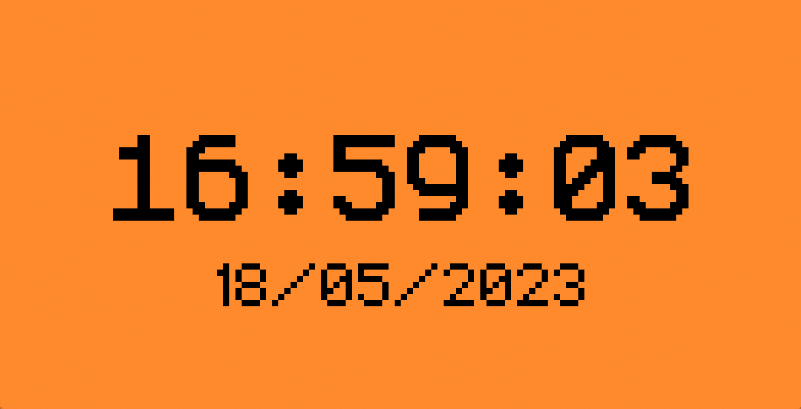

# GoodFAPs — Test Cases

## 1. Pico Pass Good FAP

Steps:

1. Go to Applications → NFC → PicoPass.

   **Expected result:** the application has opened.

2. Press "Read card".

   **Expected result:** the card was read.

3. Save the card.

   **Expected result:** card succesfuly saved.

4. Click Elite Dictionary Attack.

   **Expected result:** the attack will begin.

## 2. Weather Station Good FAP

Steps:

1. Go to Applications → SubGHz → Weather Station.
2. Use the second Flipper to simulate any weather station at different frequencies, and click Read on the first.

   **Expected result** reading the weather station succeeded.

3. Press Config and enable Hopping.

   **Expected result:** hopping works and stations are read on different frequencies.

4. Press Config and lock screen.
   
   **Expected result:** screen lock working.

5. Exit the reading menu and go to the About menu.

   **Expected result:** information in the About menu is displayed.

## 3. Apps. Working with applications from the catalog

Description:

In their basic form, there are no applications; they can be installed from the directory in companion
applications, or from the web version. The application itself will appear in the submenu
corresponding to its type (BT, Games, etc.)

Steps:

1. Connect the flipper to a companion or web platform.

   **Expected result:** Flipper connected successfully.

2. Install any number of applications.

   **Expected result:** the applications were installed and appeared in the list with a normal icon and the same name as in the directory.

3. Launch the application.

   **Expected result:** the application has launched and is working normally.

4. Quit the application.

   **Expected result:** the application closed and the flipper continued to work normally.

5. The application closed and the flipper continued to work normally.

   **Expected result:** the applications have been successfully updated and are working.

6. Uninstall multiple apps using companion, web platform and file browser.

   **Expected result:** uninstall multiple applications using the companion, the web platform and through the file browser of the flipper itself.

## 4. AWR Flasher Good FAP

Description:

Installation of these applications is similar to other applications in the catalog. They differ in that
these are applications that we contribute.

Steps:

1. Connect the AVR microcontroller according to the pinout:

   * MISO - PA6
   * MOSI - PA7
   * SCK - PB3
   * RESET - PB2
   * GND - GND
   * VCC - 3V3

2. Run Dump AVR and save the dump.
   
   **Expected result:**
     1. The chip was identified correctly during Dump.
     2. Dump saved.

3. Launch Flash AVR and flash the chip.

   **Expected result:**
     1. Flash chip detected correctly.
     2. The firmware selection menu has appeared.
     3. The firmware flashed successfully.

4. Launch ISP programmer.

   **Expected result:** ISP Programmer correctly identified the chip

5. Execute: `avrdude.exe -p m2560 -c stk500v1 -P COM7 -U lock:r:lock.hex:r -U hfuse:r:hfuse.hex:r -U
   lfuse:r:lfuse.hex:r -U efuse: r:efuse.hex:r`
   
   with m2560 replaced with the required chip (m328p) and COM port numbers.

   **Expected result:** avrdude worked.

## 5. Video Game Module Using

Steps:

1. Insert the Module comb into the flipper.

   **Expected result:**
   1. Initialization message appeared.
   2. The Module icon has appeared in the status bar.

2. Insert the HDMI cable already connected to the monitor into the module.

   **Expected result:** the image from the flipper began to duplicate on the monitor.

3. Download and run the game "Air Arkanoid".

   **Expected result:** accelerometer control works.

## 6. Tools Good FAP's

Steps:

1. Go to Apps > Tools > Clock.

   **Expected result:** the clock has activated full screen and is running. The clock format is determined in the flipper settings.

   

2. Go to Apps > Tools > NFC/Rfid Detector.
3. Click on About.

   **Expected result:** a tab with information about the application has opened.

4. Click Detect Field Type.

   **Expected result:** the application work area has opened, the screen is blank.

5. Bring the flipper to any reader or even two nearby ones.

   **Expected result:** the flipper recognizes both NFC and RFID; if two readers are nearby, both types of cards will be displayed.

## 7. Signal Generator Good FAP

Steps:

1. Launch PWM Generator.
   **Expected result:** the application has started.

2. Check on different outputs and frequencies.

   **Expected result:** the PWM signal is generated with the specified parameters on the specified pin.

3. Run Clock Generator and Test at different frequencies and dividers.

   **Expected result:** the clock signal is generated with the specified parameters on the specified pin.

## 8. NFC Magic Good FAP

Steps:

1. Go to Applications → NFC → NFC Magic.

   **Expected result:** the application has opened.

2. Click Check Magic Tag and attach the card of the required type.

   **Expected result:** the card was considered.

3. Click Write Gen1a and select the desired card from the list of saved ones.

   **Expected result:** a message appeared about the riskiness of the operation, after confirmation the information was recorded on the card.

4. Press "Wipe".

   **Expected result:** information from the card has been deleted.

## 9. SPI Mem Manager Good FAP

Steps:

1. Connect the chip according to the pinout in the application and launch the application.

   **Expected result:** the application has started.

2. Read chip.

   **Expected result:** data was considered.

3. Write previously read data.

   **Expected result:** data recorded.

4. Erase data from chip.

   **Expected result:** chip cleared.

## 10. Video Game Module Flashing

Steps:

1. Insert the Module comb into the flipper.

   **Expected result:**
     1. Initialization message appeared.
     2. The Module icon has appeared in the status bar.

2. Install the VGM tool application from the catalog.
3. Launch the application.

   **Expected result:** if the device is connected to a monitor, screen mirroring will stop.

4. Click "Install official firmware".

   **Expected result:**
     1. A dialog box appeared.
     2. If you agree, the installation begins.
     3. After the installation process is complete, a success window appears and a sound signal is heard.

5. Copy the file with the module firmware to the SD.
6. In VGM tool select installation from file and select the firmware file on the SD.

   **Expected result:** the firmware has been installed.

7. Disconnect the VGM from the flipper, and press the Boot button with a needle and connect the cable from the PC.

   **Expected result:** a file manager window opened on the PC.

8. Transfer the firmware file to the device.

   **Expected result:** after the transfer, the window closed and the firmware began.
